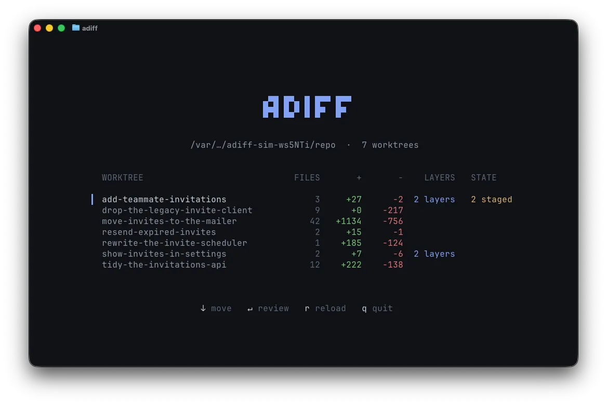

# adiff

An agent finishes a piece of work and leaves you a diff. adiff puts the conversation on the code:
you comment on the lines in a terminal, the agent that wrote them answers under your words, and a
point stays open until you settle it.

<pre align="center">brew install Newbie012/tap/adiff</pre>
<pre align="center">npx skills add Newbie012/agent-diff --skill adiff -g</pre>

<a href="docs/install.md">Other ways to install</a>

### Features

- ⚡ **Live review** - A comment reaches the agent at once, and it starts work.
- 💬 **Answers in place** - The agent replies under your comment, or asks you to decide.
- 🌿 **Review in parallel** - Keep several agents going from one list of branches.
- 🔗 **Pull request remarks** - Turn them on, then accept or dismiss each one without leaving the terminal.
- 🗺️ **Read in layers** - Follow the agent's own order, or read the diff by file.

### Usage

1. Install adiff and its skill with the two commands above.
2. In your agent, run `/adiff layer this work and hand it over for review`.
3. Comment on the lines. The agent answers under your words, and `?` lists every key.

## Requirements

The Homebrew formula installs one compiled binary, which draws the terminal itself and needs no Node
at all. A global npm install runs on Node 22 or newer, and the terminal there needs Node 26: adiff
finds one among your fnm, nvm, asdf, volta and Homebrew installs and runs the terminal on that, and
says so when there is none, while every other command runs where you are.

## Notes

adiff is alpha, and one person's tool. Every release goes out under the `alpha` tag.

The [wiki](https://github.com/Newbie012/agent-diff/wiki) is the documentation: installing adiff, a
walkthrough of one review, every key, the commands an agent runs, and what to do when something goes
wrong. Its pages are written in `wiki/` in this repository and published from there.

The project docs live in `.agents/`: `AGENTS.md` covers making a change, `ARCHITECTURE.md` how the code
is laid out.

## License

MIT

## Sponsors

	

